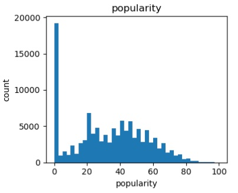
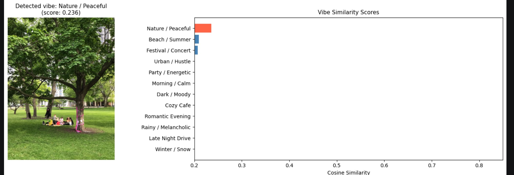

# 🎵 image2playlist
### *Upload a photo. Get a playlist that matches its vibe.*

> **Anisa Dye · Sharon Lee · Szuyu Chi**

---

## 🎯 The Problem

Have you ever been somewhere and wanted music that matched the moment — but didn't know what to search for?

Whether it's a cozy coffee shop, a late night drive, or a park picnic with friends, finding music that *fits* requires you to already know what you're looking for. **image2playlist** removes that barrier.

> **Upload a photo of where you are → get a playlist that matches the vibe.**

This exposes users to new songs, new genres, and new artists they'd never find on their own — bridging the gap between a visual moment and a musical one.

---

## 🗂 Data Cleaning

**Source:** Kaggle Spotify Tracks Dataset — 114,000 raw tracks

**Pipeline:**
1. Dropped null values and sorted by popularity
2. Merged genre tags for duplicate tracks (same song appearing across multiple genres)
3. Deduplicated on `(track_name, artist)`, keeping the merged-genre record
4. Filtered out spoken-word content (`speechiness < 0.66`)
5. Applied **popularity floor** (`popularity > 50`) to remove the long tail of obscure tracks

**Why the popularity filter mattered:**



The raw dataset had a massive spike of ~19,000 tracks at popularity = 0. Without filtering, CLIP was semantically matching correctly — but returning songs nobody had heard of. The popularity floor brought the working dataset to **~19,000 well-known tracks**.

---

## 🤖 Discovering the Model

We needed a way to connect images to music without any paired training data. That led us to **CLIP** (Contrastive Language-Image Pretraining), released by OpenAI.

**How CLIP works:**

CLIP was trained on **400 million image-text pairs** from the internet. Its training objective — contrastive learning — forces matching pairs *close* together and non-matching pairs *far apart* in a shared 512-dimensional vector space:

```
Image Encoder (ViT-B/32)   →  512-d vector ─┐
                                              ├─ cosine similarity → [−1, 1]
Text Encoder (Transformer) →  512-d vector ─┘
```

**Why this works for music:** A photo of a rainy street and the phrase *"melancholic and reflective, with a bittersweet sadness"* end up geometrically close — not because we trained it, but because CLIP learned from real-world image captions that described similar scenes.

**Zero-shot transfer:** No music-specific training required. CLIP generalizes directly to our task.

---

## 🔬 Methodology

### Step 1 — Song Representation
CLIP's text encoder was trained on natural language captions, not numeric arrays. So instead of feeding it raw audio features (`danceability=0.82`), we converted every song's features into a **descriptive prose sentence**:

> *"An upbeat acoustic track with a warm and content feel — blending acoustic and electronic elements — suited for a quiet happy afternoon. Genre: indie pop, soul."*

This is stored as `clip_metadata` for each track and is what enables meaningful cosine similarity with image embeddings.

### Step 2 — Precomputed Embeddings
We batch-encoded all ~19,000 song descriptions into 512-d vectors using CLIP's text encoder and saved them to disk (`song_embeddings.npy`). At query time, only the uploaded image needs to be encoded — the song embeddings are already ready.

### Step 3 — Vibe Detection
We built a **12-category vibe taxonomy**, each defined by a natural-language probe sentence:

| Vibe | Probe Description |
|---|---|
| ☕ Cozy Cafe | warm indoor lighting, quiet coffee shop, soft acoustic music |
| ❄️ Winter / Snow | snow-covered street, quiet and cold, peaceful winter morning |
| 🏖️ Beach / Summer | bright sand and waves, sunny outdoor energy |
| 🌧️ Rainy / Melancholic | grey sky, wet streets, reflective and melancholic |
| 🎉 Party / Energetic | crowded dancefloor, coloured lights, high energy |
| 🌹 Romantic Evening | candlelit dinner, couple at night, intimate and warm |
| 🌿 Nature / Peaceful | forest trail, open meadow, calm and grounding |
| 🏙️ Urban / Hustle | busy city intersection, crowded subway, fast-paced |
| 🚗 Late Night Drive | highway at night, city glow, empty road |
| 🌅 Morning / Calm | soft sunlight through curtains, slow and gentle start |
| 🌑 Dark / Moody | deep shadows, dimly lit, heavy and atmospheric |
| 🎸 Festival / Concert | outdoor stage, crowd, live music energy |

At query time: image embedding → cosine similarity with all 12 probe embeddings → closest match = detected vibe.

### Step 4 — Playlist Generation
Songs are ranked by cosine similarity to the image embedding. A diversity filter ensures results span artists and genres rather than clustering around one sound.

### Full Pipeline
```
User uploads image
        ↓
CLIP Image Encoder (ViT-B/32)
        ↓
512-d image embedding
        ↓
Cosine similarity vs. 12 vibe probes → Detected vibe label
        ↓
Cosine similarity vs. ~19,000 song embeddings
        ↓
Diverse Top-K playlist 🎶
        ↓
Spotify enrichment (embed players)
```

---

## 🎨 Live Example

The image below shows the app detecting **Nature / Peaceful** from a park photo, with a cosine similarity score of 0.236. The gap between the top vibe and the others shows confident detection:



---

## ⚠️ Limitations

| Limitation | Details |
|---|---|
| **12 vibes only** | Some images don't map cleanly to any of the 12 categories — a stadium or gym has no close match, lowering similarity scores and reducing playlist quality |
| **Long tail in dataset** | The original dataset was heavily weighted toward low-popularity and non-English tracks; required significant filtering |
| **Popularity vs. diversity tradeoff** | A strict popularity floor improves recognizability but reduces exposure to niche artists — finding the right threshold required iteration |
| **No audio matching** | CLIP matches on vibe description, not actual audio. A song described as "melancholic" matches a rainy image even if the audio tempo is fast |
| **Spotify API rate limits** | Enrichment calls to Spotify's API can hit rate limits quickly when processing at scale |
| **Roman alphabet only** | Filtering for Latin-script titles removes non-English music that might otherwise be a great vibe match |

---

## 📊 Results

### Vibe Detection Accuracy
Evaluated on a labeled test set of **24 images** (2 per vibe category):

| Metric | Value |
|---|---|
| Total test images | 24 |
| Vibes tested | 12 (2 per vibe) |
| Correct predictions | 20 / 24 |
| **Vibe detection accuracy** | **83.3%** |

### User Study — Qualitative Rating (1–5 scale)

| Method | Avg. Rating (1–5) |
|---|---|
| Random baseline | < 3.26 |
| Popularity baseline | < 3.26 |
| **CLIP (ours)** | **3.76** |

**Success criterion:** CLIP must exceed both baselines by ≥ 0.5 points. ✅ **Passed.**

---

## 🗂 Project Structure

```
image2playlist/
├── data/
│   ├── spotify_cleaned_final.csv   # Cleaned dataset (~19,000 tracks after filtering)
│   ├── song_index.csv              # Row-aligned song metadata
│   ├── song_embeddings.npy         # Precomputed CLIP embeddings [~19000, 512]
│   └── sample_images/
├── notebooks/
│   ├── 01_data_cleaning.ipynb      # Ingestion, cleaning, clip_metadata construction
│   ├── 02_clip_setup.ipynb         # CLIP setup, batch embedding precomputation
│   └── 03_vibe_mapping.ipynb       # Vibe taxonomy, pipeline, evaluation
├── src/
│   └── helpers.py                  # VIBE_TAXONOMY, build_playlist, Spotify helpers
├── demo/
│   └── app.py                      # Streamlit app
├── .env                            # Spotify API credentials (not committed)
└── README.md
```

> `song_embeddings.npy` is excluded from git (>100MB). Run `02_clip_setup.ipynb` locally to generate it.

---

## 🚀 Running Locally

```bash
pip install torch torchvision
pip install git+https://github.com/openai/CLIP.git ftfy regex tqdm
pip install streamlit spotipy pandas numpy pillow pillow-heif python-dotenv

# Add Spotify credentials to .env, then:
streamlit run demo/app.py
```

